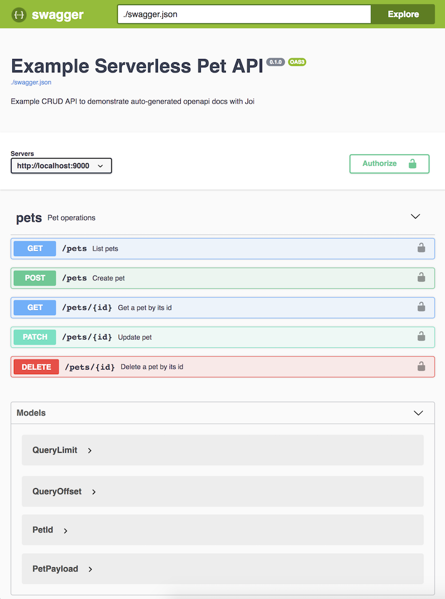

# Serverless OpenAPI Joi Plugin
[](https://travis-ci.com/anttiviljami/serverless-openapi-joi) [](http://anttiviljami.mit-license.org)

Serverless plugin for creating OpenAPI specifications with Joi validation.

This plugin allows you to define input validation for your serverless API endpoints and generates OpenAPI definitions
from validation rules, which can be either saved somewhere or served directly as an endpoint in the API itself.

See full example project boilerplate here: [anttiviljami/serverless-openapi-joi-boilerplate](https://github.com/anttiviljami/serverless-openapi-joi-boilerplate)

## Philosophy

As developers, we are lazy when it comes to writing documentation.

Even with nice modern tools like the OpenAPI standard (previously known as Swagger) that allow us to auto-generate
API docs and clients from definition files, those files tend to be tideous to write and out-of-date.

The best way to make sure API documentation stays up-to-date is to generate it from API code itself and actively use the
generated API definition in our development workflow.

With **serverless-openapi-joi**, OpenAPI specification is generated as a by-product of defining Joi validation rules to
our API endpoints. As a bonus, we get nice machine- and human-readable [Boomified](https://github.com/hapijs/boom)
validation errors.

Heavily inspired by [hapi-swagger](https://github.com/glennjones/hapi-swagger)

## Getting started

```
npm install --save serverless-openapi-joi
```

In your serverless.yml:

```yaml
plugins:
  - serverless-openapi-joi

functions:
  api:
    handler: handler.api
    events:
      - http:
          path: swagger.json
          method: get
          private: true
      - http:
          path: pets
          method: get
          private: true
      - http:
          path: pets/{id}
          method: get
          private: true
      - http:
          path: pets
          method: post
          private: true
      - http:
          path: pets/{id}
          method: patch
          private: true
      - http:
          path: pets/{id}
          method: delete
          private: true
```

In your Serverless API handler:

```typescript
import OpenAPIHandler from 'serverless-openapi-joi/handler';

const openapi = new OpenAPIHandler({
  title: 'Example Pet API',
  description: 'Example CRUD API with Serverless OpenAPI Joi plugin',
  version: '0.1.0',
  baseurl: 'http://localhost:8000', // ServiceEndpoint for your lambda
  swaggerEndpoint: '/swagger.json', // endpoint for serving OpenAPI definition as json
  routes, // defined below
});

export async function handler(event) {
  return openapi.handler(event);  // you should catch any errors from your handler
  // serverless-openapi-joi throws validation errors as Boom errors
}
```

Validation models are defined using Joi:

```typescript
import Joi from 'joi';

const validation = {
  petId: Joi.number().integer()
    .description('Unique identifier for pet in database')
    .example(1)
    .label('PetId'),

  petPayload: Joi.object({
    name: Joi.string()
      .description('Name of the pet')
      .example('Garfield')
      .label('PetName'),
  }).label('PetPayload'),

  limit: Joi.number().integer().positive()
    .description('Number of items to return')
    .example(25)
    .label('QueryLimit'),

  offset: Joi.number().integer().min(0)
    .description('Starting offset for returning items')
    .example(0)
    .label('QueryOffset'),
};
```

Routes define API operations using validation rules for request body, path parameters, query parameters and headers:

```typescript
const routes = [
  {
    method: 'GET',
    path: '/pets',
    handler: getPets, // event is passed through to a standard serverless handler function after validation
    summary: 'List pets',
    description: 'Returns all pets in database',
    tags: ['pets'],
    validation: {
      queryStringParameters: {
        limit: validation.limit,
        offset: validation.offset,
      },
    },
    responses: {
      200: { description: 'List of pets in database' },
    },
  },
  {
    method: 'GET',
    path: '/pets/{id}',
    handler: getPetById,
    summary: 'Get a pet by its id',
    description: 'Returns a pet by its id in database',
    tags: ['pets'],
    validation: {
      pathParameters: {
        id: validation.petId,
      },
    },
    responses: {
      200: { description: 'Pet object corresponding to id' },
      404: { description: 'Pet not found' },
    },
  },
  {
    method: 'POST',
    path: '/pets',
    handler: createPet,
    summary: 'Create pet',
    description: 'Crete a new pet into the database',
    tags: ['pets'],
    validation: {
      payload: validation.petPayload,
    },
    responses: {
      201: { description: 'Pet created succesfully' },
    },
  },
  {
    method: 'PATCH',
    path: '/pets/{id}',
    handler: updatePetById,
    summary: 'Update pet',
    description: 'Update an existing pet in the database',
    tags: ['pets'],
    validation: {
      pathParameters: {
        id: validation.petId,
      },
      payload: validation.petPayload,
    },
    responses: {
      200: { description: 'Pet updated succesfully' },
      404: { description: 'Pet not found' },
    },
  },
  {
    method: 'DELETE',
    path: '/pets/{id}',
    handler: deletePetById,
    summary: 'Delete a pet by its id',
    description: 'Deletes a pet by its id in database',
    tags: ['pets'],
    validation: {
      pathParameters: {
        id: validation.petId,
      },
    },
    responses: {
      200: { description: 'Pet deleted succesfully' },
      404: { description: 'Pet not found' },
    },
  },
];
```

OpenAPI v3 docs are automatically generated for API and served at `/swagger.json`.

These can be viewed using tools like Swagger UI



